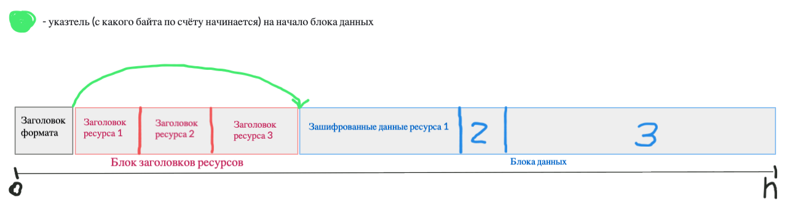

Формат называется .her (HateEngineResources), мой искромётный юмор.\
Состоит из 3-х основных частей: Заголовок формата, блок с заголовками ресурсов и блок с самими данными

#### Заголовок формата (занимает строго 20 байт):
- Первые 4 байта - версия формата, сделал на всякий случай
- 8 байт - указатель на начало блока данных, можно обойтись и без него, но с ним проще упаковка
- 8 байт - количество ресурсов, можно и без этого поля, но с ним прощё распаковка

 

#### Блок с заголовками ресурсов:
Он содержит любое адекватное количество заголовков ресурсов
##### Заголовок ресурса:
- 8 байт - длина строки имени ресурса
- n байт - имя ресурса
- 8 байт - оригинальный размер пакуемого файла
- 8 байт - выровненный размер пакуемого файла (далее напишу чем различаются)
- 8 байт - указатель на начало данных, смещение относительно указателя на начало блока данных

 

#### Блок с данными
Тупо зашифрованные данные через алгоритм Blowfish. Этот алгоритм шифрует чанками по 8 байт, именно для этого есть 2 поля с размером. Если изначальный размер файла 454 байта (оригинальный размер), то либа добавит 2 байта заполненных нулями и размер станет 456 (выровненный размер). Далее при распаковке мы будем дешифровать 456 байт (выровн. размер) и после распаковки обрежем на 2 байта (до 454 байт (оригинальный размер)) 

### Картинка
